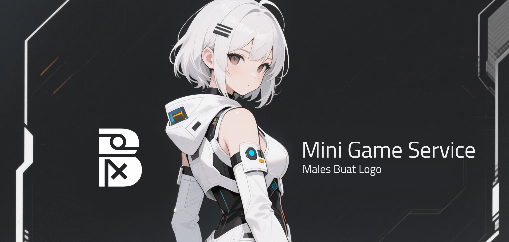

# Mini Game Service ⚔️
<p align="center">
  
</p>

<p align="center">
  
  
  
  
</p>

## About Mini Game Service
A simple turn-based role-playing mini-game service is a lightweight game service that features turn-based mechanics, where each player takes turns performing actions in a strategic game flow. This system is designed as a REST API, so that the entire game process—such as character creation, turn setting, attack calculation, and game data management—can be easily accessed and integrated via HTTP endpoints. This API-based approach allows the mini-game to run on various platforms, whether as part of a web application, mobile application, or third-party service, without being tied to a specific interface. With a simple yet flexible design, this service provides an exciting gaming experience while making it easy for developers to implement it according to their needs.

## Installation
- Make sure you have installed [this service](https://github.com/BosToken/waifu_api). It is used to retrieve random character data to support the game service. 
- Copy file `.env.example` to `.env`.
- Configure your `.env` variable.
- Clone project.
```bash
  git clone https://github.com/BosToken/mini_game_service.git
```
- Install package
```bash
  npm install
```
- Migrate table
```bash
  npx prisma migrate dev
```
- Migrate data seed
```bash
  node ./prisma/seeder/seed.js
```
- Run service
```bash
  nodemon index.js
```

## Environment Variables
To run this project, you will need to add the following environment variables to your .env file

| Variable             | Description                                                                |
| ----------------- | ------------------------------------------------------------------ |
| `PORT` | The port where the REST API server runs (for example, `3000` or `8080`). |
| `DATABASE_URL` | URL connection to the database (e.g., MySQL) containing the username, password, host, port, and database name. |
| `WAIFU_SERVICE_BASE_URL` | Base URL for [this service](https://github.com/BosToken/waifu_api). Provides waifu data/features used by the game. |
| `SALT_ROUND` | Number of rounds for password hashing using bcrypt for data security. |
| `JWT_SECRET` | Secret key for signing and verifying JWT tokens as a user authentication mechanism. |
| `BOT_SECRET` | Secret key to secure communication with Discord bots or similar services connected to the system. |

## API Reference
Fire references can be found in this [documentation](./API-REFRENCES.md).

## Authors
- [@BosToken](https://www.github.com/bostoken)

